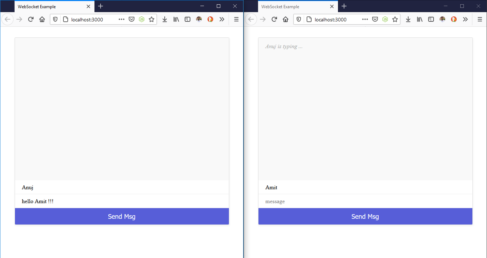
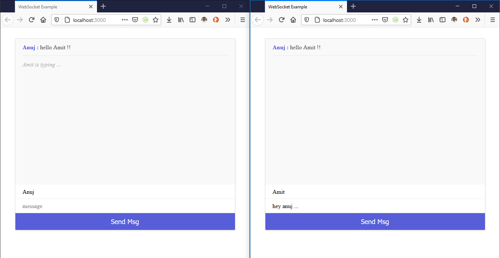
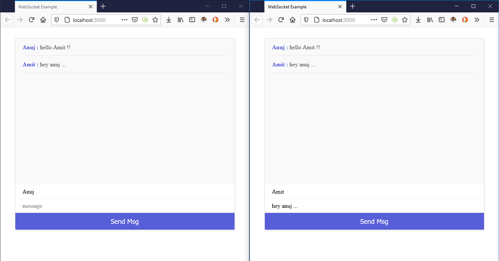

# websocket example application

### This application is built while learning the basic concepts of websocket.

## Features : 

##### 'Person x is typing ...' message is broadcasted to all other clients
##### And the chat message to all the clients.

## How to Run the application

1. npm install
2. nodemon index
3. Open https://localhost:3000 in multiple browser windows.

